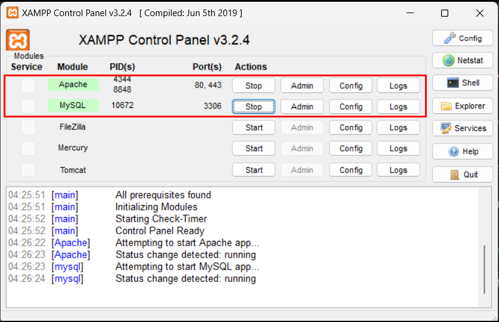
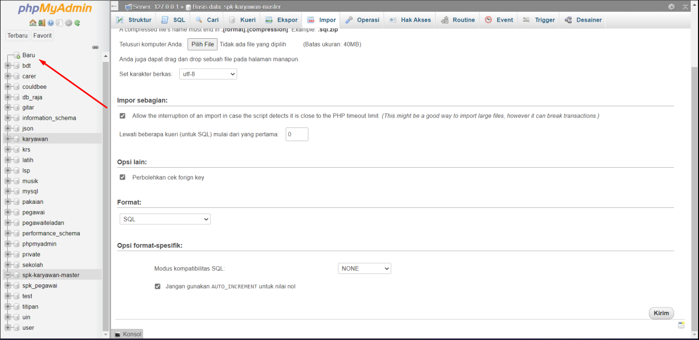
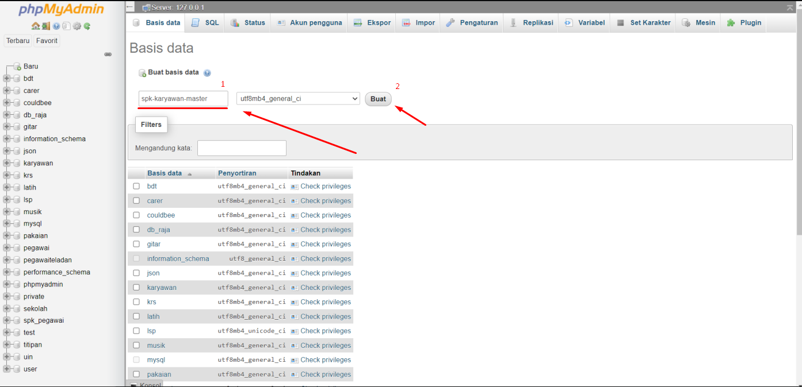
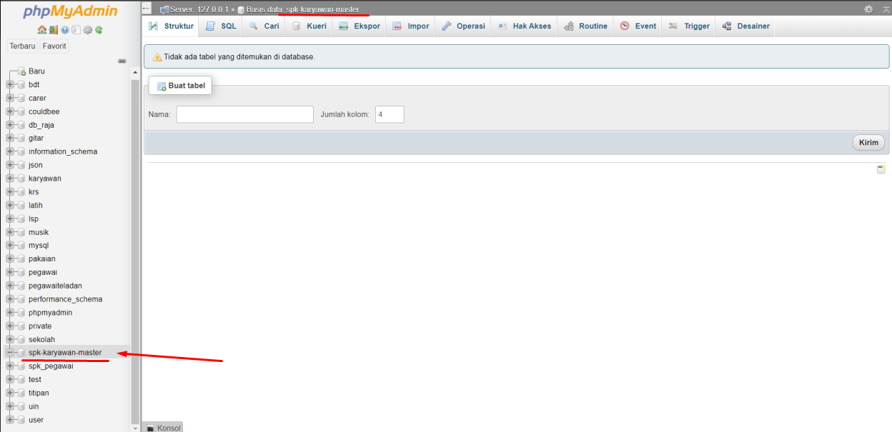

# BIKIN DATABASE DI PHPMYADMIN (XAMPP)

## 1. START APACHE & MYSQL DI XAMPP

## 2. BUKA PHPMYADMIN & KLIK BUAT

## 3. MASUKKAN NAMA BASIS DATA & KLIK BUAT

## 4. KLIK NAMA DATABASE YANG SUDAH DIBUAT

## 5. SELESAI